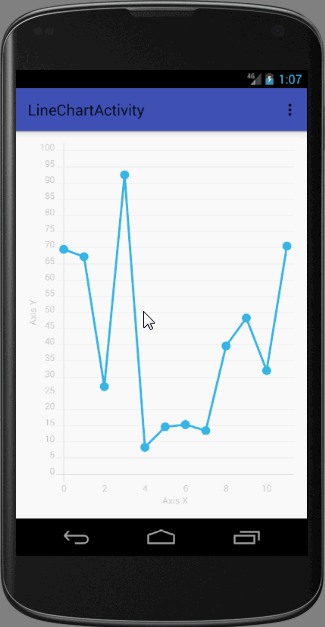
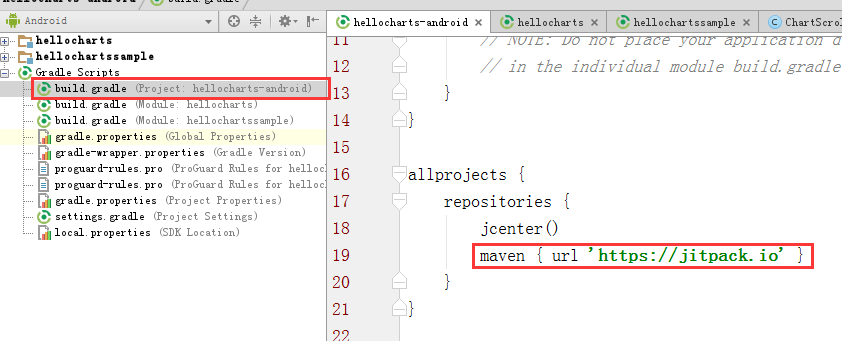

# hellocharts-android项目使用

开源地址：[https://github.com/open-android/hellocharts-android](https://github.com/open-android/hellocharts-android "https://github.com/open-android/hellocharts-android")

# 运行效果

## 使用步骤

### 1. 在project的build.gradle添加如下代码(如下图)

	allprojects {
	    repositories {
	        maven { url "https://jitpack.io" }
	    }
	}

### 2. 在Module的build.gradle添加依赖

    compile 'com.github.open-android:hellocharts-android:v1.5.8'

### 3.布局文件使用对应Chart

	<lecho.lib.hellocharts.view.LineChartView
        android:id="@+id/chart"
        android:layout_width="match_parent"
        android:layout_height="match_parent" />

### 4.Activity初始化

	mChart = (LineChartView) findViewById(R.id.chart);
	//...省略，请参考hellowchartssample
	mChart.setLineChartData(data);//给图表设置数据

	

	

	
